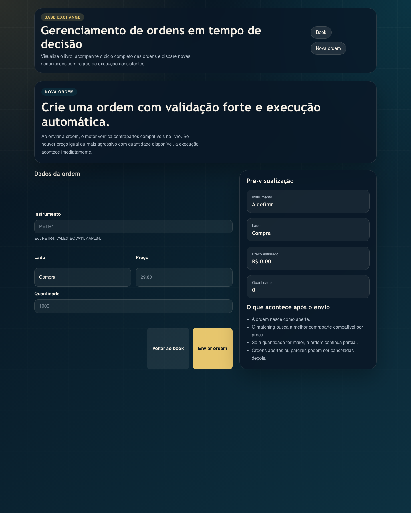
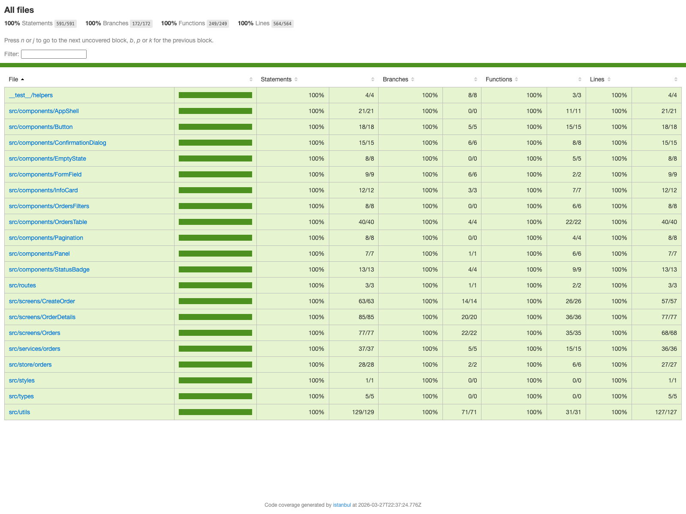

# BASE Exchange Order Management

Aplicação front-end em React para visualizar, criar, acompanhar e cancelar ordens de compra e venda com regras de execução automática.

## Descrição

Este projeto implementa o módulo de Gerenciamento de Ordens da BASE Exchange, com foco em experiência do usuário, organização de código e regras de negócio para o fluxo de ordens no book.

## Tecnologias utilizadas

- TypeScript
- React 19
- Vite
- React Router DOM
- Styled Components
- Zustand
- Vitest
- Testing Library
- ESLint

## Funcionalidades

- Visualização de ordens em datagrid
- Filtros por ID, instrumento, status, lado e data
- Ordenação por colunas
- Paginação
- Tela de detalhes com histórico de status
- Registro de execuções da ordem
- Criação de ordens com validação
- Cancelamento com confirmação
- Motor de matching para execução automática
- Testes automatizados

## Capturas de tela

### Book de ordens

<table>
  <tr>
    <th>Web</th>
    <th>Mobile</th>
  </tr>
  <tr>
    <td>
      
    </td>
    <td>
      
    </td>
  </tr>
</table>

### Criação de ordem

<table>
  <tr>
    <th>Web</th>
    <th>Mobile</th>
  </tr>
  <tr>
    <td>
      
    </td>
    <td>
      
    </td>
  </tr>
</table>

### Detalhes da ordem

<table>
  <tr>
    <th>Web</th>
    <th>Mobile</th>
  </tr>
  <tr>
    <td>
      
    </td>
    <td>
      
    </td>
  </tr>
</table>

## Estrutura do projeto

```text
src/
 ├── components/
 ├── routes/
 ├── screens/
 │    ├── Orders/
 │    ├── CreateOrder/
 │    └── OrderDetails/
 ├── services/
 │    └── orders/
 ├── store/
 │    └── orders/
 ├── styles/
 ├── types/
 └── utils/
```

Cada screen segue a separação:

- `useContainer.ts`: lógica, estado local e ações
- `index.tsx`: view
- `styles.ts`: estilização

## API simulada

A aplicação usa uma camada assíncrona simulada em `src/services/orders/orders.service.ts`, com persistência em `localStorage`, para representar as operações de listagem, criação e cancelamento de ordens.

## Regras de execução

- Toda ordem criada inicia com status `OPEN`
- A execução acontece quando existe contraparte compatível do lado oposto
- Para compra, a venda deve ter preço menor ou igual ao preço da ordem
- Para venda, a compra deve ter preço maior ou igual ao preço da ordem
- Quando a quantidade é parcial, a ordem continua como `PARTIAL`
- Apenas ordens `OPEN` ou `PARTIAL` podem ser canceladas

## Como instalar e rodar o projeto

### Pré-requisitos

- Node.js 20+ recomendado
- Yarn 1.22+

### Instalação

```bash
yarn install
```

### Ambiente de desenvolvimento

```bash
yarn dev
```

Depois disso, abra o endereço exibido no terminal, normalmente:

```bash
http://localhost:5173
```

## Scripts disponíveis

```bash
yarn dev
yarn test
yarn lint
yarn build
yarn preview
```

## Testes

Os testes cobrem principalmente:

- motor de matching
- regras de cancelamento
- validação de criação
- persistência da API simulada

### Cobertura de testes

O projeto possui cobertura de testes em `100%` para `statements`, `branches`, `functions` e `lines`.



## .gitignore

O projeto já possui `.gitignore` configurado para ignorar arquivos de build, dependências, logs e arquivos locais de editor.

## Observação para entrega

Ao publicar no GitHub pessoal, mantenha a referência:

`This is a challenge by Coodesh`
